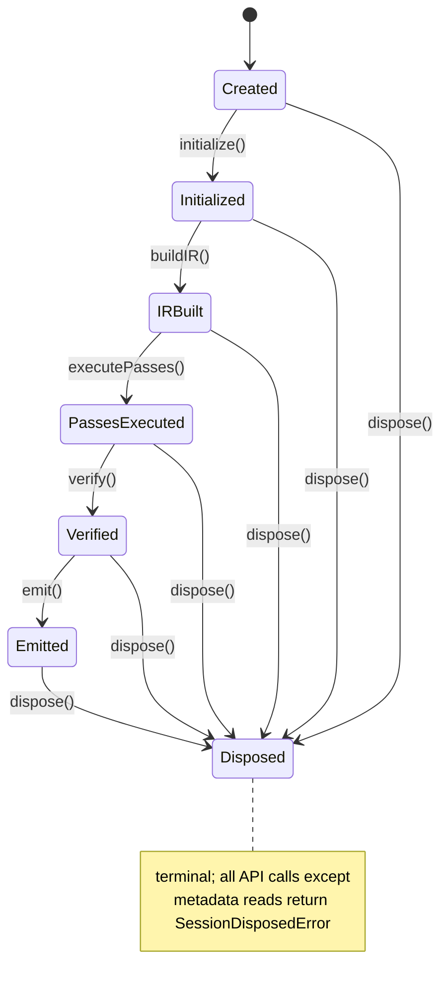

# RFC-001: AnalysisSession + IR Runtime Architecture

- **Status:** Proposed
- **Authors:** Intelligence Core Team
- **Last Updated:** 2026-05-25
- **Target Version:** `@i2c/intelligence` 0.1.x foundation

## 1) Goals

This subsystem defines the production runtime boundary for static analysis execution. It solves the following problems:

1. Replaces process-wide singleton state with **explicit, isolated AnalysisSession instances**.
2. Provides a deterministic, replayable lifecycle for end-to-end analysis runs.
3. Establishes immutable IR snapshots with typed provenance and confidence metadata.
4. Defines pass contracts and deterministic orchestration with invalidation-aware incremental execution.
5. Enables safe worker parallelism without cross-session mutable sharing.
6. Defines stable API boundaries for cache hydration, diagnostics emission, and artifact output.
7. Supports very large Next.js monorepos through bounded memory retention and cold IR eviction.

## 2) Non-Goals

This subsystem intentionally does **not** solve:

1. Next.js plugin wiring (`withIntelligence`) or compiler transform injection behavior.
2. UI/dashboard rendering, runtime mount telemetry ingestion, or graph visualization.
3. Domain-specific pass semantics (e.g., route heuristics quality tuning).
4. Distributed multi-host execution scheduling.
5. Remote cache protocol specification (only integration points are defined).
6. Security sandboxing for untrusted pass code.

## 3) Architectural Constraints

The runtime MUST satisfy the following constraints:

1. **Deterministic execution:** identical input snapshot + config + toolchain version => byte-identical outputs.
2. **Immutable session state transitions:** phase outputs are append-only snapshots; no in-place mutation of committed state.
3. **No global mutable singletons:** all mutable runtime state is owned by `AnalysisSession`.
4. **Replayable runs:** session event log and artifact digests are sufficient for deterministic replay validation.
5. **Worker-safe operation:** inter-thread communication uses serialized immutable payloads or read-only shared buffers.
6. **Explicit ownership:** each in-memory structure has a single owner and lifecycle; shared access is read-only views.
7. **Fail-fast corruption policy:** structural IR corruption aborts session and invalidates dependent artifacts.

## 4) Core Runtime Model

### 4.1 Components

```text
AnalysisSession
 ├─ SessionContext (immutable config + input snapshot + services)
 ├─ SessionArtifacts (immutable output snapshots + manifests)
 ├─ PassManager (dependency graph + scheduler + invalidation planner)
 ├─ IRStore (versioned IR snapshots + indexes + hash manifests)
 └─ DiagnosticsStore (ordered diagnostics stream + counters)
```

### 4.2 Ownership and lifecycle boundaries

- `AnalysisSession` is the **sole mutable orchestrator**.
- `SessionContext` is created once and frozen at `initialize`.
- `IRStore` owns all IR object graphs and snapshot indexes.
- `PassManager` owns pass graph, scheduling decisions, and execution ledger.
- `DiagnosticsStore` owns canonical diagnostic ordering and de-duplication indexes.
- `SessionArtifacts` is write-once at `emit` and becomes immutable.

### 4.3 Data ownership matrix

| Structure | Owner | Mutability | Visibility | Disposal |
|---|---|---|---|---|
| Session config | SessionContext | immutable | all passes (read-only) | session dispose |
| Source snapshot map | SessionContext | immutable | parse/build passes | session dispose |
| IR nodes | IRStore | mutable during active pass build buffer, immutable when committed | read-only by downstream passes | GC + explicit eviction |
| Pass ledger | PassManager | append-only | runtime internals | session dispose |
| Diagnostics list | DiagnosticsStore | append-only, finalized sort at verify | emit + API read | session dispose |
| Emitted files manifest | SessionArtifacts | immutable | callers | optional retained after dispose |

## 5) Session Lifecycle

Lifecycle is strict and monotonic:

```text
create -> initialize -> buildIR -> executePasses -> verify -> emit -> dispose
```

### 5.1 State machine



### 5.2 Transition guarantees

- Each transition is idempotent only if explicitly marked (`dispose` only).
- Any failure in a transition marks state as `Failed(<phase>)`; only `dispose` is allowed afterwards.
- `emit` is forbidden unless `verify` completed with no fatal diagnostics.
- Transition commits are atomic with respect to externally visible state.

## 6) IR Architecture

## 6.1 IR tiers

1. **AST IR**: language-faithful syntax tree wrappers + file/module boundaries.
2. **Semantic IR**: resolved symbols, component/route entities, edges, traits.
3. **Graph IR**: normalized multi-graph projections (import/render/ownership/runtime).

## 6.2 Provenance model

Every IR entity includes:

- `origin`: source file path + byte range + parser version.
- `derivation`: pass ID + input snapshot IDs + timestamp logical tick.
- `lineage`: parent entity IDs (if transformed/merged).

## 6.3 Confidence metadata

Entities and edges carry:

- `confidence.score` in `[0,1]`
- `confidence.basis` (`static_resolved`, `heuristic`, `inferred`, `fallback`)
- optional `confidence.notes[]`

Confidence metadata is immutable post-commit; updates require a new derived entity version.

## 6.4 Mutability and ownership rules

- Passes mutate only **ephemeral builder buffers** obtained from `IRStore.beginWrite(passId)`.
- Commit operation seals buffer into immutable snapshot with new `snapshotId`.
- Direct mutation of committed snapshots throws `ImmutableIRViolationError`.

## 6.5 Serialization behavior

- Each snapshot serializes to canonical JSON (stable key order, stable arrays, UTF-8, LF).
- Binary sidecar optional for large indexes (`.irb`), keyed by content hash.
- Serialization includes schema version, toolchain version, and digest manifest.

## 7) Pass System

### 7.1 Pass contract

```ts
export type PassId = string;

export interface PassContext {
  readonly session: AnalysisSessionHandle;
  readonly inputSnapshots: readonly SnapshotId[];
  readonly cancellation: CancellationToken;
  readonly workerPool: WorkerPoolHandle;
  readonly cache: SessionCacheView;
}

export interface PassResult {
  readonly producedSnapshots: readonly SnapshotId[];
  readonly diagnostics: readonly Diagnostic[];
  readonly invalidations: readonly InvalidationRecord[];
  readonly metrics: PassMetrics;
}

export interface AnalysisPass {
  readonly id: PassId;
  readonly stage: 'build-ir' | 'analyze' | 'verify' | 'emit-prep';
  readonly consumes: readonly IRKind[];
  readonly produces: readonly IRKind[];
  readonly dependsOn: readonly PassId[];
  readonly deterministic: true;
  run(ctx: PassContext): Promise<PassResult>;
}
```

### 7.2 Scheduling and dependencies

- Pass graph must be a DAG; cycle detection occurs at session init.
- Topological order is canonicalized by `(depth, passId lexicographic)`.
- Passes with disjoint write sets may run concurrently if `parallelSafe=true`.

### 7.3 Invalidation-aware execution

- Input digest diff computes dirty entity/file sets.
- Pass declares invalidation scope (`file`, `symbol`, `route`, `global`).
- Scheduler skips pass if cache hit + no upstream invalidation intersection.

### 7.4 Parallel-safe passes

- Parallel passes cannot write same IR partition key.
- `IRStore` enforces partition locks by `(irKind, partitionId)`.
- Merge phase is deterministic and single-threaded.

## 8) Determinism Guarantees

1. **Traversal ordering:** file paths sorted by normalized POSIX path bytes.
2. **Stable IDs:** IDs derived from canonical tuple hashing (`kind|path|span|name|saltVersion`).
3. **Serialization ordering:** maps sorted by key; arrays sorted by stable comparator documented per type.
4. **Hashing strategy:** SHA-256 over canonical bytes; manifest hash is Merkle root of artifact hashes.
5. **Merge semantics:** n-way merge resolves conflicts by deterministic precedence rules:
   - higher confidence,
   - then lower provenance depth,
   - then lexicographic source path,
   - then stable entity ID.

## 9) Concurrency Model

### 9.1 Worker boundaries

- Main session thread owns lifecycle and committed stores.
- Workers perform pure compute on immutable inputs and return delta payloads.
- Workers cannot mutate session state directly.

### 9.2 Cross-session isolation

- No memory sharing across sessions except read-only deduplicated cache blobs.
- Session IDs namespace all temp files, locks, and in-memory registries.

### 9.3 Immutable sharing

- Large read-only AST buffers may be shared through `SharedArrayBuffer` with immutable protocol version pinning.

### 9.4 Cancellation semantics

- Cooperative cancellation token propagated to all passes/workers.
- Cancellation transitions session to `Cancelled`; partial outputs are non-emittable unless explicitly checkpointed.

### 9.5 Stale-run invalidation

- Session has `epoch` and `inputFingerprint`.
- Worker result includes originating epoch; mismatched epoch results are discarded.

## 10) Incremental Integration

Integration points with invalidation/cache:

1. **Invalidation graph** stores edges: input file -> symbols -> IR nodes -> passes -> artifacts.
2. **Dependency propagation** computes impacted pass frontier using reverse edges.
3. **Partial recomputation** rebuilds only dirty partitions and descendants.
4. **Cache hydration** loads prior snapshot manifests, validates schema/tool versions, and materializes hot partitions lazily.

Session integration flow:

```text
initialize()
  -> hydrate cache index
  -> compute input diff
  -> build invalidation frontier
executePasses()
  -> schedule impacted passes only
  -> commit new snapshots
  -> update invalidation graph + cache entries
```

## 11) Failure Model

### 11.1 Failure classes

- **Fatal:** IR corruption, pass contract violation, non-determinism detection, serialization integrity mismatch.
- **Recoverable:** single-file parse error, unresolved symbol, heuristic ambiguity, worker timeout (if configured retry succeeds).

### 11.2 Corruption handling

- On corruption: mark session failed, quarantine affected cache keys, emit fatal diagnostic, block `emit`.

### 11.3 Transform rollback interaction

- Session runtime itself is immutable-commit based; rollback means reverting to prior committed snapshot ID, never in-place undo.

### 11.4 Diagnostics policy

- Diagnostics are recorded even for fatal failure up to failure point.
- Ordering is stable by `(severityRank, filePath, spanStart, code)`.

## 12) Memory Model

1. **AST retention policy:** keep full AST only for dirty/hot files; retain compact syntax summaries for cold files.
2. **Cold IR eviction:** LRU by partition with pinned roots for current frontier.
3. **Cache residency:** promote partitions by reuse frequency; cap memory by configurable budget (default percentage of heap).
4. **Large monorepo scaling:** sharded IR partitions by route subtree/module package; bounded per-partition materialization.

## 13) Public APIs (TypeScript)

```ts
export type SessionState =
  | 'created'
  | 'initialized'
  | 'ir-built'
  | 'passes-executed'
  | 'verified'
  | 'emitted'
  | 'failed'
  | 'cancelled'
  | 'disposed';

export interface SessionContext {
  readonly sessionId: string;
  readonly epoch: number;
  readonly config: Readonly<AnalysisConfig>;
  readonly input: Readonly<InputSnapshotManifest>;
  readonly environment: Readonly<RuntimeEnvironmentInfo>;
}

export interface SessionArtifacts {
  readonly manifestHash: string;
  readonly files: readonly EmittedArtifact[];
  readonly snapshotRefs: readonly SnapshotRef[];
}

export interface AnalysisSession {
  readonly id: string;
  readonly state: SessionState;
  readonly context?: SessionContext;

  initialize(input: InputSnapshotManifest): Promise<SessionContext>;
  buildIR(): Promise<SnapshotRef[]>;
  executePasses(targets?: readonly PassId[]): Promise<PassExecutionReport>;
  verify(): Promise<VerificationReport>;
  emit(outputDir: string): Promise<SessionArtifacts>;
  cancel(reason?: string): void;
  dispose(): Promise<void>;

  getDiagnostics(filter?: DiagnosticFilter): readonly Diagnostic[];
  getSnapshot(kind: IRKind, ref: SnapshotRef): Readonly<IRSnapshot>;
}

export interface PassManager {
  register(pass: AnalysisPass): void;
  plan(frontier: InvalidationFrontier): PassExecutionPlan;
  execute(plan: PassExecutionPlan, ctx: SessionExecutionContext): Promise<PassExecutionReport>;
}

export interface IRStore {
  beginWrite(passId: PassId, kind: IRKind, partition: PartitionId): IRWriteBuffer;
  commit(buffer: IRWriteBuffer): SnapshotRef;
  read(ref: SnapshotRef): Readonly<IRSnapshot>;
  evict(policy: EvictionPolicy): EvictionReport;
}

export interface DiagnosticsStore {
  add(diagnostic: Diagnostic): void;
  addMany(diagnostics: readonly Diagnostic[]): void;
  list(filter?: DiagnosticFilter): readonly Diagnostic[];
  finalizeOrdering(): void;
}
```

## 14) Migration Plan

Incremental migration from singleton registry:

1. **Phase A (compat shell):** introduce `AnalysisSession` that internally wraps existing singleton registry but enforces lifecycle API.
2. **Phase B (state extraction):** move mutable registry maps into `SessionContext` + `IRStore` instance fields.
3. **Phase C (pass refactor):** convert pipeline phases to `AnalysisPass` contracts with explicit inputs/outputs.
4. **Phase D (determinism hardening):** add stable ID/hashing and canonical serialization gates in CI.
5. **Phase E (incremental planner):** integrate invalidation graph + cache hydration per-session.
6. **Phase F (singleton removal):** delete process-wide registry exports; keep temporary adapter for one minor release.

Backward compatibility requirement: CLI and Next plugin call sites continue to invoke `runPipeline(config)` while internally delegating to session API until deprecation window ends.

## 15) Example Deterministic Execution Flow

Given files `app/page.tsx`, `app/dashboard/page.tsx`, `components/Nav.tsx`:

1. `create`: session `S-20260525-0001` created with config hash `Hc`.
2. `initialize`: input snapshot sorted paths hashed -> `Hi`; cache hydrated for matching `Hc+Hi`.
3. `build IR`:
   - parse files in lexical order,
   - commit AST partitions (`ast:p0`, `ast:p1`),
   - semantic pass resolves symbols -> snapshots `sem:p*`.
4. `execute passes`:
   - pass plan topologically sorted,
   - `route-detect` and `component-catalog` run parallel (disjoint partitions),
   - deterministic single-thread merge builds graph IR `graph:render`, `graph:import`.
5. `verify`:
   - run structural invariants + unresolved symbol checks,
   - diagnostics finalized in stable order.
6. `emit`:
   - serialize artifacts in canonical ordering,
   - compute per-file SHA-256 and manifest Merkle root,
   - write outputs and cache snapshot refs.
7. `dispose`:
   - release worker handles,
   - evict non-pinned partitions,
   - keep emitted artifact manifest for caller reference.

Repeating the run with unchanged inputs yields identical snapshot hashes and byte-identical emitted files.

## 16) Open Risks

1. **Memory pressure risk:** semantic IR for very large monorepos may exceed heap despite partitioning.
2. **Pass granularity risk:** coarse pass invalidation may reduce incremental wins.
3. **Determinism drift risk:** upstream parser/compiler version changes may alter spans/AST shape.
4. **Worker overhead risk:** serialization cost can dominate for small partitions.
5. **Cache trust risk:** stale or corrupted cache metadata can poison incremental planning without robust validation.
6. **Migration complexity risk:** adapting legacy passes to strict read/write contracts may surface latent coupling and require staged rewrites.

